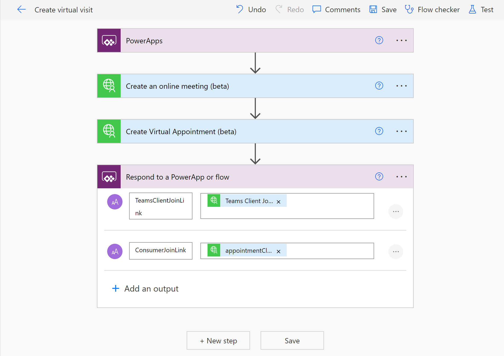

# Virtual Visit Sample Connector

Sample custom connector for virtual appointment API.

## Scenario

A very common healthcare scenario for providers as well as payors is creating an on-demand virtual visit. The Teams platform Microsoft has a Virtual Appointment capability available through the Microsoft Graph that extends the *onlineMeeting* to include enhancements like a mobile-browser join (without requiring a custom communication service or download like the Teams app), an enhanced waiting room, and additional reporting/analytics for virtual appointments. Additionally, meetings can be associated to meeting ID's from 3rd party scheduling systems directly within the virtual appointment definition.

Unfortunately, at this time there is not a published Connector for these API calls, so building a solution requires some additional steps and skills to either manually call the Graph API or build a custom connector.

## Solution

This repository includes a sample OpenAPI (Swagger) definition which can be imported through the Power Platform maker portal and used to test out the capabilities. While creating a custom connector is not overly complex, it can be helpful to learn from an example instead of starting from a completely "blank page".

As of this release, the virtualAppointment capabilities are in [public preview](https://docs.microsoft.com/en-us/graph/versioning-and-support#beta-version), which is reflected in the OpenAPI definition.

## Deployment

The sample connector OpenAPI definition is available from this repository. [Virtual Visit OpenAPI definition](./Virtual-Visit.swagger.json)

Creating a custom connector to the Microsoft Graph is a 3-step process. These steps are outlined in this [Microsoft Tech Community video](https://techcommunity.microsoft.com/t5/healthcare-and-life-sciences/create-a-custom-powerapp-connector-to-graph-api/ba-p/3494104).

The official documentation for deploying a custom connector from an OpenAPI definition is available at [Microsoft Docs](https://docs.microsoft.com/en-us/connectors/custom-connectors/define-openapi-definition#import-the-openapi-definition-for-power-automate-and-power-apps)

## Usage

1. First, identify an online meeting ID for which you will set up as a virtualAppointment. If an online meeting does not exist, the custom connector includes an Action for doing this, which will supply an online meeting ID field, as well as the practitioner join link.
2. Second, use the Create Virtual Appointment (beta) action to add the virtual visit capabilities and consumer join link.

The screenshot below shows an example of how this could be called from a Power App leveraging a Power Automate cloud flow automation, assuming no Online Meeting existed. It will return the join links to the app.

The join links can be distributed using SMS, email, secure portal messages, etc. through additional steps in this automation.

## Background

The Microsoft Graph is the gateway to data and intelligence in Microsoft 365 includes many capabilities that are useful when building apps, including low-code applications using Logic Apps and the Power Platform. There are hundreds of Microsoft Connectors that make use of these services, while many more capabilities are available just out of sight.

Custom connectors can provide a purpose-driven experience, standardizing how low-code developers interact with both well-known or custom APIs, improving time to value and reducing technology risk.

## Contributing

This project welcomes contributions and suggestions.  Most contributions require you to agree to a
Contributor License Agreement (CLA) declaring that you have the right to, and actually do, grant us
the rights to use your contribution. For details, visit https://cla.opensource.microsoft.com.

When you submit a pull request, a CLA bot will automatically determine whether you need to provide
a CLA and decorate the PR appropriately (e.g., status check, comment). Simply follow the instructions
provided by the bot. You will only need to do this once across all repos using our CLA.

This project has adopted the [Microsoft Open Source Code of Conduct](https://opensource.microsoft.com/codeofconduct/).
For more information see the [Code of Conduct FAQ](https://opensource.microsoft.com/codeofconduct/faq/) or
contact [opencode@microsoft.com](mailto:opencode@microsoft.com) with any additional questions or comments.

## Trademarks

This project may contain trademarks or logos for projects, products, or services. Authorized use of Microsoft 
trademarks or logos is subject to and must follow 
[Microsoft's Trademark & Brand Guidelines](https://www.microsoft.com/en-us/legal/intellectualproperty/trademarks/usage/general).
Use of Microsoft trademarks or logos in modified versions of this project must not cause confusion or imply Microsoft sponsorship.
Any use of third-party trademarks or logos are subject to those third-party's policies.
